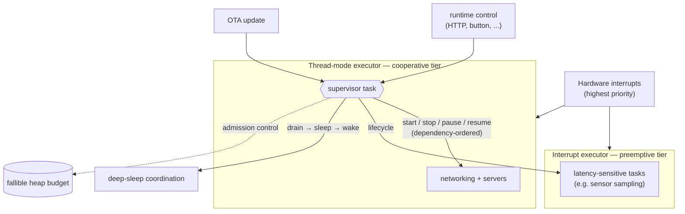

# embassy-supervisor

[](https://crates.io/crates/embassy-supervisor)
[](https://docs.rs/embassy-supervisor)

**Supervision trees for bare-metal async Rust.** A composable architecture for real
[embassy](https://embassy.dev) firmware — a dependency-ordered task lifecycle over layered
executors, with a governed heap and coordinated power and OTA — the structure and guarantees of an
RTOS with none of its kernel, stacks, or overhead. The `no_std` **`embassy-supervisor`** crate is
its drop-in core.

---

## How we got here: Rust, embassy, and the missing layer

Two ideas have quietly changed what embedded development feels like.

The first is **Rust**: memory safety without a garbage collector, data-race freedom checked at
compile time, zero-cost abstractions, an expressive type system, and a first-class `no_std` story.
Whole categories of the bugs that haunt C firmware — buffer overflows, use-after-free, data races —
simply don't compile.

The second is **[embassy](https://embassy.dev)**, a modern async framework for microcontrollers. You
write `async fn`s; the compiler turns them into state machines; a tiny executor runs them with no
kernel, no per-task stacks, and no busy-waiting. When nothing is ready, the core sleeps — exactly
what a battery wants. On top of that, embassy ships HALs, timers, sync primitives, a network stack,
USB, and bootloader support.

### Where this sits in the embedded world

Embedded projects usually pick one of two extremes:

- **Hand-rolled bare metal** — a super-loop and carefully tuned interrupt handlers. Fast and lean,
  great for hard-realtime, but everything is manual and the loop turns to spaghetti as features pile
  up.
- **A preemptive RTOS** — a pleasant task model, but you take on a kernel, a stack per task, and the
  RAM and latency overhead that come with it.

embassy lands **right in between**: RTOS-like task ergonomics at close-to-bare-metal cost, with a
*priority spectrum* you tune per task instead of a one-size kernel.

What embassy doesn't hand you is the **lifecycle**: which task starts before which, what to stop when
you go to sleep, how to scale workers under load, how to apply an update safely. With one or two
tasks you don't notice. On a real product — several sensors, a radio, a couple of network services, a
power budget, field updates — coordinating *when* each piece comes up, pauses, scales, and tears down
becomes the hard part.

That coordination layer, extracted from a real-world climate/environmental device and made
HAL-agnostic, is **`embassy-supervisor`**.

## One chip, many gears: embassy's executor versatility

A standout embassy capability is that a single firmware can run **multiple executors at different
priorities**, and order tasks *within* an executor — so you choose the right scheduling per job:

- A **cooperative thread-mode executor** runs the bulk of the work (networking, servers,
  housekeeping). Tasks yield at `.await`; no preemption, no locking headaches.
- A separate **interrupt-driven executor** runs a latency-sensitive tier (say, sensor sampling) at a
  priority that **preempts** the cooperative tier — so a quick read never waits behind a long
  request — while staying below the raw hardware interrupt handlers.
- **Per-task priority ordering** inside an executor keeps, for example, a radio/driver runner ahead
  of the request handlers that depend on it.

The result: preemptive priority tiers *and* cooperative scheduling from one async codebase, dialed in
per task. The supervisor is built to orchestrate tasks across all of these tiers.

## Architecture at a glance



## What the supervisor adds

`embassy-supervisor` is a small, `no_std`, `#![forbid(unsafe_code)]` library. You declare the graph
once with the `supervisor_graph!` macro; the supervisor does the rest:

- **Dependency-ordered bring-up and reverse teardown** — the topological order is computed **at
  compile time** (a dependency cycle is a *compile error*); bring-up follows it and teardown reverses it.
- **Lifecycle modes** — `Terminate` (exit and respawn), `Pause` (park and resume while keeping a held
  resource like an open bus or socket), `OnDemand` (started on demand to scale a pool).
- **Elastic pools** — grow workers under load, shrink them after a cooldown, within a fixed budget.
- **Dependency- and pool-honoring runtime control** — start/stop/pause/resume a task (or a whole
  pool) from anywhere; a stop cascades through dependents, a start through dependencies.

```rust
use embassy_supervisor::{supervisor_graph, Supervisor};

// One declaration generates the node `static`s and a single `GRAPH` bundling the
// node slots, deps, and compile-time order. `app` depends on `net`, so it starts after it.
supervisor_graph! {
    node NET = Terminate, deps: [],    spawn: net_task;
    node APP = Terminate, deps: [NET], spawn: app_task;
}

// in your supervisor task:
let sup = Supervisor::new(&GRAPH);                    // infallible — a cycle is a compile error
sup.start(spawner).expect("spawn");                   // brings up net, then app
```

The library is feature-gated — the control plane and pools are optional, so a minimal build is just
the dependency-ordered core. See [`supervisor/`](supervisor/).

## Plays well with the rest of the stack

The supervisor focuses on *lifecycle*; it composes naturally with the patterns a real device needs:

- **Fallible heap allocation.** A heap whose allocations can *fail gracefully* — return nothing, shed
  load, answer "busy" — instead of aborting the firmware, plus a reservation gate for code paths that
  need a guaranteed-free block. The supervisor's start/stop is the admission control that keeps total
  usage inside the budget: stop a subsystem and its memory comes back.
- **Deep-sleep power management.** A light dormant sleep (wake on an external event) and a deeper
  sleep that powers the core down while retaining RAM and warm-resuming where it left off. The
  supervisor *coordinates the transition* — drain services in dependency order before the rails drop,
  then resume paused tasks and respawn the rest on wake.
- **OTA firmware update** with a safe A/B swap and automatic rollback — demonstrated end-to-end in
  the firmware below.

## Where it fits

The supervisor earns its keep on devices that run **several interdependent services** and have to
**manage power and updates** — not on a single-task blinky. Some sweet spots:

- **Battery-powered field sensor nodes** (low-power / LPWAN links, multi-year life): the duty cycle is
  wake &rarr; bring the radio and stack up in order &rarr; sample &rarr; publish &rarr; tear it all
  down cleanly &rarr; deep-sleep. The supervisor sequences exactly that.
- **Connected gateways and edge hubs**: many concurrent services and connections with strict start-up
  order, elastic worker/connection pools, runtime reconfiguration, and fleet-wide OTA.
- **Smart-building climate, lighting, and safety controllers**: multiple sensors, control loops, and
  connectivity that must come up in order and degrade gracefully under pressure — the family the
  supervisor was born in.
- **Field-updatable connected products and fleets**: OTA-first devices where an update has to drain
  live services, free resources, swap, and roll back on failure.
- **Robotics, drones, and motion control**: a preemptive sensor/control tier alongside cooperative
  telemetry and comms, with mission-phase lifecycle (arm/disarm, mode changes).
- **Wearables, portable instruments, and energy/EV monitors**: duty-cycled sensing plus wireless,
  with careful state handling across sleep.

## embassy-supervisor in action

The [`firmware/`](firmware/) crate is a complete, flash-it-today application on an RP-class MCU,
built to put every part of the supervisor through its paces:

- **USB networking** and an **HTTP control and observability plane** — drive the supervisor's
  runtime control (start/stop/pause/resume) and watch the task graph respond.
- an **elastic pool of keep-alive workers** that grows under load and shrinks after a cooldown.
- **OTA firmware update** with a safe A/B swap and rollback, orchestrated as a lifecycle transition.

It's the approachable, runnable example — clone the repo and follow the build and run steps in
[`firmware/README.md`](firmware/README.md) to see the orchestration story end to end.

## What's in this repo

| Crate | What |
|-------|------|
| [`supervisor/`](supervisor/) | the `embassy-supervisor` library — HAL-agnostic, `no_std`, headed for crates.io (see [`supervisor/README.md`](supervisor/README.md)) |
| [`firmware/`](firmware/) | the demo application |
| [`bootloader/`](bootloader/) | the embassy-boot A/B bootloader the demo's OTA swaps against |

Dual-licensed under **MIT OR Apache-2.0**.

---

*Modern async, RTOS-grade lifecycle, bare-metal footprint — pick all three.*
