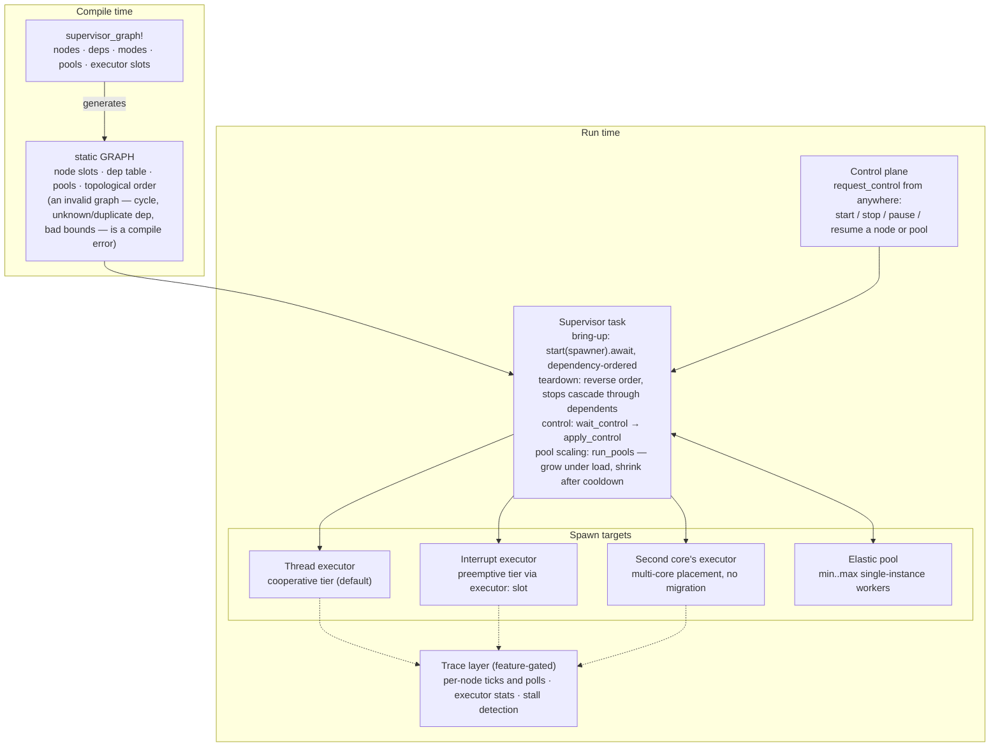

# embassy-supervisor

[](https://crates.io/crates/embassy-supervisor)
[](https://docs.rs/embassy-supervisor)

**Supervision trees for bare-metal async Rust.** A composable architecture for real
[embassy](https://embassy.dev) firmware — a dependency-ordered task lifecycle over layered
executors, with a governed heap and coordinated power and OTA — the structure and guarantees of an
RTOS with none of its kernel, stacks, or overhead. The `no_std` **`embassy-supervisor`** crate is
its drop-in core.

---

## Table of Contents

- [Why a supervision layer](#why-a-supervision-layer)
- [One chip, many gears: executor versatility](#one-chip-many-gears-executor-versatility)
- [Architecture at a glance](#architecture-at-a-glance)
- [What the supervisor adds](#what-the-supervisor-adds)
- [Plays well with the rest of the stack](#plays-well-with-the-rest-of-the-stack)
- [Where it fits](#where-it-fits)
- [The demo firmware in action](#the-demo-firmware-in-action)
- [What's in this repo](#whats-in-this-repo)

## Why a supervision layer

Two ideas have quietly changed what embedded development feels like. The first is **Rust**: memory
safety without a garbage collector, data-race freedom checked at compile time, zero-cost
abstractions, and a first-class `no_std` story — whole categories of the bugs that haunt C firmware
simply don't compile. The second is **[embassy](https://embassy.dev)**: you write `async fn`s, the
compiler turns them into state machines, and a tiny executor runs them with no kernel, no per-task
stacks, and no busy-waiting. When nothing is ready, the core sleeps — exactly what a battery wants.

Embedded projects usually pick one of two extremes: **hand-rolled bare metal** (fast and lean, but
the super-loop turns to spaghetti as features pile up) or a **preemptive RTOS** (a pleasant task
model, but you take on a kernel, a stack per task, and the RAM and latency overhead that come with
it). embassy lands right in between — RTOS-like task ergonomics at close-to-bare-metal cost.

What embassy doesn't hand you is the **lifecycle**: which task starts before which, what to stop
when you go to sleep, how to scale workers under load, how to apply an update safely. With one or
two tasks you don't notice. On a real product — several sensors, a radio, a couple of network
services, a power budget, field updates — coordinating *when* each piece comes up, pauses, scales,
and tears down becomes the hard part. That coordination layer, extracted from a real-world
climate/environmental device and made HAL-agnostic, is **`embassy-supervisor`**.

## One chip, many gears: executor versatility

A standout embassy capability is that a single firmware can run **multiple executors at different
priorities** — and the supervisor orchestrates tasks across all of them:

- A **cooperative thread-mode executor** runs the bulk of the work (networking, servers,
  housekeeping). Tasks yield at `.await`; no preemption, no locking headaches.
- A separate **interrupt-driven executor** runs a latency-sensitive tier at a priority that
  **preempts** the cooperative tier — a quick sensor read never waits behind a long request —
  while staying below the raw hardware interrupt handlers.
- A **second core** can run its own thread executor; the supervisor places tasks on it through the
  graph (multi-core: each task lives on one core; nothing migrates).
- **Per-task priority ordering** inside an executor keeps, for example, a radio/driver runner ahead
  of the request handlers that depend on it.

Preemptive priority tiers *and* cooperative scheduling from one async codebase, dialed in per task.

## Architecture at a glance

The general shape — a compile-time graph declaration, one supervisor task, and the executors,
pools, and layers it orchestrates (the [demo firmware](firmware/README.md) is a concrete,
flashable instantiation of exactly this):



App tasks are the graph *nodes* — each hangs off whichever executor slot its `executor:` annotation
names (unannotated → the default thread executor). The supervisor never runs task code itself; it
only spawns, parks, and tears down tasks onto the tiers, and scales the pool. A **detached** node
is a self-managed daemon the supervisor starts once and then leaves alone.

## What the supervisor adds

`embassy-supervisor` is a small, `no_std`, `#![forbid(unsafe_code)]` library. You declare the graph
once with the `supervisor_graph!` macro; the supervisor does the rest:

- **Dependency-ordered bring-up and reverse teardown** — the topological order is computed **at
  compile time**, and the whole graph is validated there too: cycles, unknown or duplicate deps,
  duplicate names, bad pool bounds are all *compile errors*. Bring-up follows the order, teardown
  reverses it, and bring-up is `async`: it awaits each cross-executor spawn rendezvous instead of
  blocking.
- **Lifecycle modes** — `Terminate` (exit and respawn), `Pause` (park and resume while keeping a
  held resource like an open bus or socket), `OnDemand` (started on demand to scale a pool) — plus
  `disabled` (control-started) and `detached` (self-managed daemon) node states.
- **Elastic pools** — grow workers under load, shrink them after a cooldown, within a fixed budget.
- **Multi-executor, multi-core placement** — `executor:` slots put nodes on an interrupt-priority
  tier or a second core, straight from the graph declaration.
- **Dependency- and pool-honoring runtime control** — start/stop/pause/resume a task (or a whole
  pool) from anywhere; a stop cascades through dependents, a start through dependencies.
- **Trace observability (feature-gated)** — per-task CPU ticks, poll counts, and per-executor
  idle/in-poll stats, with zero cost when the features are off.

```rust
use embassy_supervisor::{supervisor_graph, Supervisor};

// One declaration generates the node `static`s and a single `GRAPH` bundling the
// node slots, deps, and compile-time order. `app` depends on `net`, so it starts after it.
supervisor_graph! {
    node NET = Terminate, deps: [],    spawn: net_task;
    node APP = Terminate, deps: [NET], spawn: app_task;
}

// in your supervisor task (an async context):
let sup = Supervisor::new(&GRAPH);                    // infallible — a cycle is a compile error
sup.start(spawner).await.expect("spawn");             // brings up net, then app
```

The library is feature-gated — the control plane, pools, and tracing are optional, so a minimal
build is just the dependency-ordered core. The full model — lifecycle matrix (what each operation
does per mode), the `supervisor_graph!` DSL, and the recipes — lives in
[`supervisor/README.md`](supervisor/README.md).

## Plays well with the rest of the stack

The supervisor focuses on *lifecycle*; it composes naturally with the patterns a real device needs:

- **Fallible heap allocation.** A heap whose allocations can *fail gracefully* — return nothing,
  shed load, answer "busy" — instead of aborting the firmware, plus a reservation gate for code
  paths that need a guaranteed-free block. The supervisor's start/stop is the admission control
  that keeps total usage inside the budget: stop a subsystem and its memory comes back.
- **Deep-sleep power management.** A light dormant sleep (wake on an external event) and a deeper
  sleep that powers the core down while retaining RAM and warm-resuming where it left off. The
  supervisor *coordinates the transition* — drain services in dependency order before the rails
  drop, then resume paused tasks and respawn the rest on wake.
- **OTA firmware update** with a safe A/B swap and automatic rollback — demonstrated end-to-end in
  the demo firmware.

## Where it fits

The supervisor earns its keep on devices that run **several interdependent services** and have to
**manage power and updates** — not on a single-task blinky. Some sweet spots:

- **Battery-powered field sensor nodes**: wake → bring the radio and stack up in order → sample →
  publish → tear it all down cleanly → deep-sleep. The supervisor sequences exactly that.
- **Connected gateways and edge hubs**: many concurrent services with strict start-up order,
  elastic worker/connection pools, runtime reconfiguration, and fleet-wide OTA.
- **Smart-building climate, lighting, and safety controllers**: multiple sensors, control loops,
  and connectivity that must come up in order and degrade gracefully — the family the supervisor
  was born in.
- **Field-updatable connected products**: OTA-first devices where an update has to drain live
  services, free resources, swap, and roll back on failure.
- **Robotics and motion control**: a preemptive sensor/control tier alongside cooperative telemetry
  and comms, with mission-phase lifecycle (arm/disarm, mode changes).

## The demo firmware in action

The [`firmware/`](firmware/) crate is a complete, flash-it-today application on an RP2350, built to
put every part of the supervisor through its paces:

- **USB networking** and an **HTTP control and observability plane** — drive the supervisor's
  runtime control (start/stop/pause/resume) and watch the task graph respond live.
- an **elastic pool of keep-alive workers** that grows under load and shrinks after a cooldown.
- **multi-executor and multi-core placement** — a heartbeat on the interrupt-priority tier, a
  control-started compute load on the second core.
- **OTA firmware update** with a safe A/B swap and rollback, orchestrated as a lifecycle
  transition.

It's the approachable, runnable example — clone the repo and follow
[`firmware/README.md`](firmware/README.md) for the build and run steps, the per-task breakdown,
the heap budget, and how to read the observability data.

## What's in this repo

| Crate | What |
|-------|------|
| [`supervisor/`](supervisor/) | the `embassy-supervisor` library — HAL-agnostic, `no_std`; model, lifecycle matrix, DSL, recipes, feature matrix in [`supervisor/README.md`](supervisor/README.md) |
| [`firmware/`](firmware/) | the demo application — build/run, per-task breakdown, heap budget, observability in [`firmware/README.md`](firmware/README.md) |
| [`bootloader/`](bootloader/) | the embassy-boot A/B bootloader the demo's OTA swaps against |

Dual-licensed under **MIT OR Apache-2.0**.

---

*Modern async, RTOS-grade lifecycle, bare-metal footprint — pick all three.*
