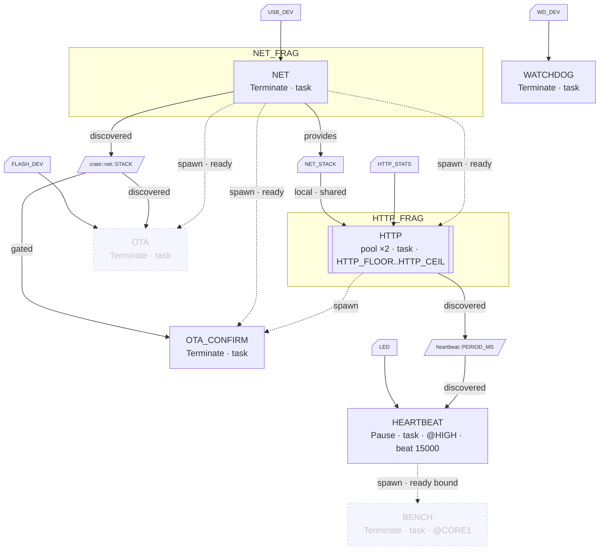

# embassy-supervisor demo firmware (RP2350)

An [embassy](https://embassy.dev) application for the RP2350 that runs an
[`embassy-supervisor`](../supervisor/README.md) task graph on real hardware:
USB networking, an HTTP control and observability plane, an elastic worker
pool, a cross-core benchmark load, and an A/B OTA update path. The supervisor
owns the orchestration; each task stays a thin wrapper around the hardware or
protocol it manages.

## The supervised task graph

The graph is composed from module-owned fragments: `net.rs` and `http.rs`
declare their slices with `supervisor_fragment!`, and `main.rs` assembles
them with `compose_graph!`. Everything reaches one `supervisor_graph!`
expansion, so cross-fragment dependencies (`http` on `net`), slot assignment,
the topological order, and the trace hooks are computed over the whole graph;
a dependency cycle is a compile error wherever its two ends are declared.

<!-- supervisor-mermaid:start -->

<!-- supervisor-mermaid:end -->

The `http` pool is both the worker pool and the control plane: each worker is
an HTTP/1.1 keep-alive server, and the pool grows under concurrent load.

### Executors

Three executors, all driven by the one core-0 supervisor. A node's placement
is a one-line `executor:` field in the graph:

| Graph slot | Executor | Runs | Nodes |
|---|---|---|---|
| *(default)* | core-0 thread executor (`#[embassy_executor::main]`) | thread mode, core 0 | `watchdog`, `net`, `http0..1`, `ota`, `ota-confirm`, the supervisor task |
| `HIGH` | `InterruptExecutor` on `SWI_IRQ_0` at priority P2 | preempts the thread executor | `heartbeat` |
| `CORE1` | thread executor on core 1 (`spawn_core1`; publishes a `SendSpawner` into the slot) | core 1 | `bench` |

### Nodes

| Node | Mode | Deps | Executor | Boot state | What it demonstrates |
|---|---|---|---|---|---|
| `watchdog` | Terminate | none | thread | started | Detached daemon: feeds the bootloader's 8 s rollback watchdog every 2 s; detached, so no cascade or respawn ever stops it. Warns on trace stalls (any poll over 100 ms) and logs liveness events. |
| `net` | Terminate | none | thread | started | Reclaimable subsystem: heap-allocates every USB and network buffer on start (~16 KB total), frees them on stop. Root of the data plane: stopping it tears `http` and `ota` down first, then returns the heap. USB peripheral threaded from `main` via `resources:`; restored on stop, re-taken on restart, no `steal()`. |
| `heartbeat` | Pause | none | `HIGH` | started | Pause/Resume with a retained resource: the task parks, keeps its LED pin, resumes the same future. Generic worker over embedded-hal's `StatefulOutputPin`; the graph's `task:` clause stamps the concrete `#[task]` shell. Beats on each blink edge (`beat_timeout: 15000`); steady states beat every 5 s. Live stall observer: on the `HIGH` tier it still runs while the thread executor is wedged, so it names the culprit during the wedge. Runtime blink parameter (`POST /api/heartbeat?ms=`), consumed through a fully private cell whose coupling is derived by `discover`. |
| `http0` | Terminate | `net ready` | thread | started | Pool floor: always on while `net` is up. Stopping the floor seeds a whole-pool stop. |
| `http1` | OnDemand | `net ready` | thread | stopped | Elastic burst worker: the pool (`min: 1, max: 2`, `DeferredShrink` with a 4 s cooldown) grows it when every running worker is busy, shrinks it after the cooldown. Each worker owns one socket and heap I/O buffers, so scaling stays inside the fixed `StackResources` socket budget. |
| `ota` | Terminate | `net ready` | thread | **disabled** | Control-started update path: detaches itself (uninterruptible), drains the pool and `net`, decodes a zstd image into DFU, arms the swap, resets. FLASH threaded from `main` via `resources:`; `mark_booted` (the `ota-confirm` path) borrows the same slot manually with `take()`/`restore()`, so the two FLASH users exclude each other at runtime. Reports its phase via `report_status`. |
| `bench` | Terminate | `heartbeat ready bound` | `CORE1` | **disabled** | Multi-core placement: the core-0 supervisor spawns and stops it on core 1 through the `CORE1` spawner slot. The graph's one bound edge: it runs only while the heartbeat is actively blinking; pausing the heartbeat stops it, resuming restarts it. Returns its slice count into the `exit:` slot (`GET /api/bench`). |
| `ota-confirm` | Terminate | `http` (pool floor), `net ready` | thread | started | Run-last ordering: depending on the pool name resolves to the floor member, so it spawns last in topological order. Detaches, waits for the network, calls `mark_booted` to confirm the image, exits. An update too broken to reach it never confirms, and the bootloader rolls back. |

### Supervisor features exercised

| Supervisor feature | Where |
|---|---|
| Task dependencies | `http`/`ota`/`ota-confirm` depend on `net`; ordered start and teardown |
| Dynamic task pools | `http` `ElasticPool` with `DeferredShrink` |
| Dependencies on a pool name | `ota-confirm` depends on `http` (its floor member), so it runs last |
| Detached nodes | `watchdog` (daemon for life), `ota` (uninterruptible once started) |
| Lifecycle: Pause/Resume | `heartbeat` keeps its LED pin across a pause |
| Generated task shells (`task:`) | every node and the pool declared with `task:`; the only hand-written `#[task]` is the supervisor task itself |
| Safe resource threading (`resources:`) | every peripheral moved from `main`; zero `steal()` in the firmware |
| Control-started nodes | `ota` and `bench` are disabled at boot, started by control |
| Multi-executor tier | `heartbeat` on the `HIGH` `InterruptExecutor` (SWI_IRQ_0 @ P2) |
| Multi-core placement | `bench` on `CORE1` via the graph's spawner slot |
| Socket budgeting | the pool scales within the fixed `StackResources` budget |
| Heap budgeting | `ota` drains `http` and `net` to free the arena for the decode |
| Runtime control | `POST /api/control` maps to `request_control` |
| Trace observability | `GET /api/tasks` and the dashboard: CPU%, max-poll, executor stats |
| Self-trace (`trace-self`) | the supervisor's own host task appears as a detached row in `/api/tasks` |
| Composed graph | `net.rs` + `http.rs` declare `supervisor_fragment!`s; `main.rs` assembles them with `compose_graph!`; cross-fragment deps resolve by name |
| Per-member pool resources | `HTTP_STATS`: member `i` takes and restores element `i`, so served counts survive a shrink/regrow |
| Reclaimable heap state (`heap-state`) | the pool's `state: zeroed HttpBufs`: one buffer set per member activation, freed on shrink; a full heap fails the grow as `Busy` instead of panicking |
| `exit:` value slot | `bench` returns a `u32` into `BENCH_EXIT`, read by `GET /api/bench` |
| One-call driver | `sup.run(&spawner)`: start + pool scaling + control, returns only on error |
| Task-asserted readiness | `net` calls `set_ready()` once the link is configured |
| Liveness heartbeat | `heartbeat` calls `beat()` per blink edge |
| Liveness policing (`liveness-monitor`) | `beat_timeout: 15000` on `heartbeat`; `watchdog` consumes `wait_health()` and logs (report only, no automatic escalation) |
| Activation generations (`epochs`) | the dashboard `gen` column: a restarted node shows it even if the page missed it being down |
| Derived dataflow | `heartbeat` carries `discover`; no `reads:`/`writes:` lists anywhere in the graph |
| Adopted dataflow | `http` adopts `set_period_ms`, `net` adopts `publish_stack`, `ota` adopts `lease_stack`, `ota-confirm` adopts `stack_ready` |
| Node status (`node-status`) | `ota` reports its phase; the dashboard JSON carries it per node |
| `restart` | the dashboard restart button (`ControlOp::Restart`): cycles a node and its transitive dependents, re-gating them |
| Bound readiness edge (`bound-deps`) | `bench` declares `heartbeat ready bound` |
| Gated reads + leases (`data-deps`) | `stack_ready` (waiting) and `lease_stack` (non-waiting), both under a `StackLease` scoped to the use |
| Shared-resource provider (`provides:`) | `net` fills the pool-wide `NET_STACK` slot and declares `provides:`; its shutdown ack clears the slot, so a spawn during a net outage fail-closes |
| Lifecycle waves | teardown and bring-up run as dependency-ordered waves: unordered nodes are signalled up front, each dependency held until its dependents ack |

### Gate budgets

`slot_timeout:` bounds each pre-spawn gate (the `executor:` slot, every
`resources:` slot, every `ready` dep) individually; expiry becomes a named
`SpawnError::Busy` with a log line instead of an infinite wait. The default
(100 ms) is sized for slots `main` filled before `start()`. This graph
overrides it only where a gate can legitimately wait: the `http` pool (2 s,
covering the shrink-then-regrow race on its member slots) and `ota` (10 s,
covering a full net stop/start underneath it). See the supervisor README for
the full gate list and semantics.

Gate bring-up on `ready` only where the assertion cannot wait on the outside
world: `net` asserts readiness once the static IPv4 config is applied (no
host, no cable needed), so a boot gate on it never blocks. Where a use can
outlive the assertion, the body guards it under a lease instead (next
section).

`beat_timeout:` is the steady-state bound, the counterpart aimed at running
nodes rather than gates. `heartbeat` declares 15 s; the monitor reports a
miss within about 1.5x the budget (~22 s) and leaves the node running: it
names what it saw, the application decides.

### The stack handle: copy at spawn, or lease per use

`net` owns the network stack and the buffers behind it; every other task only
ever holds a small `Copy` handle into those buffers, valid exactly as long as
the `net` activation that published it. One rule decides how a consumer
receives it: does the supervisor guarantee the consumer goes down before
`net` does?

- **Yes: a copy at spawn** (the `http` workers). The pool-wide `NET_STACK`
  slot is filled by `net` and named in its `provides:` clause, so net's
  shutdown ack clears it: a worker spawned while `net` is down finds the slot
  empty and the spawn fails closed. Each worker also claims the backing
  (`net::hold()`) for its whole run, so net's teardown waits on actual
  holders.
- **No: a fetch per use, under a lease** (`ota` and `ota-confirm`, both
  detached). `net::stack_ready()` waits for `net` to be ready, then leases;
  `net::lease_stack()` leases or returns `None`. A spawn-time copy would have
  no lifetime story behind it, and `ota` even stops `net` itself mid-run, so
  its lease covers the download only.

Every copy is claimed against the same lease count, which `net` drains before
freeing the buffers. The leasing primitives (`Backed`, `Leased`, `Lease`) are
documented in the supervisor README.

## Build & run (RP2350)

Requires a debug probe and [probe-rs](https://probe.rs) (defmt logs stream
over the probe; the USB port is the network link).

The firmware always runs from the ACTIVE partition under the bootloader (it
is linked at `0x10021000` and cannot boot standalone), so a first flash
installs the bootloader + firmware pair. The bootloader arms an 8 s watchdog
as its OTA rollback safety; the firmware's `watchdog` node feeds it, so a
healthy image stays up and a hung one resets and rolls back.

```sh
# Board variant: firmware/Cargo.toml uses embassy-rp `rp235xb` (SparkFun IoT
# RedBoard RP2350 / 48-GPIO). For a standard Raspberry Pi Pico 2, switch it to
# `rp235xa`. The heartbeat LED is PIN_25 (adjust in heartbeat.rs for your board).

# 1. Build both crates (release: matches the OTA heap budget and image size)
cargo build --release -p bootloader
cargo build --release -p firmware

# 2. Flash the bootloader once (-> 0x10000000)
probe-rs download --chip RP235x target/thumbv8m.main-none-eabihf/release/bootloader

# 3. Flash + run the firmware (-> ACTIVE); resets through ROM -> bootloader -> ACTIVE
#    and streams defmt with the firmware's symbols
cargo run --release -p firmware
```

The bootloader rarely changes: iterating on the firmware afterward is just
`cargo run --release -p firmware` again. `probe-rs erase --chip RP235x` +
steps 2-3 is also the recovery path if a bad image bricks the boot.

### Cargo features

| feature | default | effect |
| --- | --- | --- |
| `dns` | off | Resolve the OTA target by hostname through a real `DnsSocket`, instead of the parse-only `ota::IpDns` that only accepts literal IPv4. Pulls `embassy-net/dns`, adds a `StackResources` slot (`net::SOCKET_BUDGET`), costs ~7 KB of flash. |

```sh
cargo build --release -p firmware --features dns
```

### Supervisor features this firmware enables

Everything the demo exercises is opt-in on `embassy-supervisor`; the set is in
`firmware/Cargo.toml`:

```toml
embassy-supervisor = { path = "../supervisor", features = [
    "pool", "local-resources", "defmt",
    "trace-hooks", "trace-nested", "trace-self",      # observability
    "readiness", "liveness", "liveness-monitor",
    "epochs", "dataflow", "data-deps", "node-status",
    "restart", "bound-deps", "heap-state",
] }
```

`macros` comes from the crate's defaults and `control` via `restart`. Dropping
any opt-in compiles the corresponding clause out of the graph.

## Host network setup (USB-net)

Networking is USB-CDC-NCM: TCP/IP over the USB cable, no extra hardware. A
real application would swap in a wireless chip; only the `net` task changes,
the rest of the graph is unaffected.

The device uses the static IP `10.42.0.61/24`. Point the host's USB ethernet
interface at the same subnet, then browse to the device:

```sh
ip addr add 10.42.0.1/24 dev usb0      # interface name varies (enxXX... on some hosts)
ip link set usb0 up
xdg-open http://10.42.0.61/             # task view + stop/start/pause/resume/restart buttons
```

## Exercise the supervisor

- **Dynamic pool:** hold several concurrent connections open to the HTTP port
  so every worker is busy, and watch the pool grow `1 -> 2` in the task view
  (free heap drops as the worker spawns), then shrink ~4 s after they close
  (heap returns):
  ```sh
  for i in $(seq 6); do (sleep 12) | nc 10.42.0.61 80 & done   # 6 clients; the pool caps at 2
  ```
- **Dependency cascade:** stop `net` and watch the whole `http` pool torn down
  first, then `net` itself; free heap jumps as net returns its ~16 KB budget.
  (`net` hosts the control plane, so this drops the dashboard too; it
  illustrates the root drain.)
  ```sh
  curl -XPOST 'http://10.42.0.61/api/control?node=net&op=stop'
  ```
- **Pause/Resume:** pause `heartbeat` (LED stops; the pin is retained), then
  resume it:
  ```sh
  curl -XPOST 'http://10.42.0.61/api/control?node=heartbeat&op=pause'
  curl -XPOST 'http://10.42.0.61/api/control?node=heartbeat&op=resume'
  ```
- **Multi-core load:** start `bench` and watch core 1's executor line jump
  from idle to ~100% busy (in-poll) while core 0's numbers are untouched;
  stop it and core 1 goes quiet again. `GET /api/bench` returns the slice
  count from the last completed run.
  ```sh
  curl -XPOST 'http://10.42.0.61/api/control?node=bench&op=start'
  curl 'http://10.42.0.61/api/bench'
  ```
- **Runtime parameter:** change the heartbeat without a rebuild. `?ms=` is a
  `>0` blink half-period, `0` LED off, `<0` LED on, applied immediately:
  ```sh
  curl -XPOST 'http://10.42.0.61/api/heartbeat?ms=100'   # fast blink
  curl -XPOST 'http://10.42.0.61/api/heartbeat?ms=0'     # off
  curl -XPOST 'http://10.42.0.61/api/heartbeat?ms=-1'    # on
  ```
- **restart:** hit **restart** on `net`. The `http` pool is cycled with it
  and re-gated on the way back up, visible as the workers' `gen` incrementing.
  A plain stop-then-start of `net` does not do this: the workers keep running
  against the new instance and their `gen` does not move. (`ota-confirm` is
  detached, so it is excluded from both.)
  ```sh
  curl -XPOST 'http://10.42.0.61/api/control?node=net&op=restart'
  ```
- **Liveness monitor:** set a blink period longer than the 15 s
  `beat_timeout:`. Within ~22 s the supervisor reports the node stale over
  defmt, once, and reports it recovered on the next blink edge. The node is
  **not** stopped or restarted: the monitor reports, the application decides.
  ```sh
  curl -XPOST 'http://10.42.0.61/api/heartbeat?ms=20000'
  ```
- **Bound readiness edge:** start `bench`, then pause the heartbeat. The
  heartbeat's pause withdraws readiness, and because `bench` declared
  `heartbeat ready bound` the supervisor stops it; resuming the heartbeat
  restarts it through the full gate sequence. On the dashboard `bench` shows
  `link-stopped` while the heartbeat is paused, then its `gen` ticks as it
  comes back.
  ```sh
  curl -XPOST 'http://10.42.0.61/api/control?node=bench&op=start'
  curl -XPOST 'http://10.42.0.61/api/control?node=heartbeat&op=pause'
  curl -XPOST 'http://10.42.0.61/api/control?node=heartbeat&op=resume'
  ```

## Reading `/api/tasks`

`GET /api/tasks` reports the whole graph as JSON: `heap_free`, `heap_total`,
`tick_hz`, `now_ticks`, a `tasks` array (one object per node), and an
`executors` array. All counters are raw wrapping `u32` ticks: to get a rate,
sample twice and subtract with wrapping (`(a - b) >>> 0`; the dashboard and
the wrk script both do this). `tick_hz` converts ticks to time (here 1 MHz,
so 1 tick = 1 us).

### System / heap

- `heap_total` / `heap_free`: arena size (32768) and bytes currently free.
  Healthy: free oscillates around a steady baseline across load. Concerning:
  a monotonic downward trend between idle points (a leak), or dips near 0
  under peak load (allocation-failure risk).
- `tick_hz` / `now_ticks`: tick unit and device uptime; use `now_ticks` as
  the denominator for whole-uptime rates.

### Per-executor

Each executor reports `id, idle_ticks, exec_ticks, polls, passes`. Over a
window of `dt` ticks:

```
busy         = dt - delta(idle_ticks)           (executor not sleeping)
in-poll      = delta(exec_ticks)                (inside task polls, supervised or not)
overhead     = busy - delta(exec_ticks)         (bookkeeping + trace hooks + ISRs between polls)
unsupervised = delta(exec_ticks) - sum(delta(node.exec_ticks))
busy%        = in-poll% + overhead%
```

- `passes` counts scheduler passes, `polls` completed task polls, so
  `polls / passes` is the mean useful polls per pass. Empty passes (woken but
  nothing runnable) are booked as idle, not overhead.
- The most diagnostic comparison is `passes/s` vs `polls/s`, read as an order
  of magnitude. Healthy on RP2350 is 0.5-1.0 polls/pass. `passes/s` orders of
  magnitude above `polls/s` is a wake storm: the executor is woken constantly
  with nothing runnable and burns the core instead of sleeping; `busy%` will
  not show it, because empty passes count as idle. Idle board draw is the
  other tell (see [RP2350 note](#note-on-rp2350)).
- The unsupervised share should be near zero; a large share means significant
  work in tasks outside the graph.

Caveats: the accounting is preemption-naive unless `trace-nested` is enabled
(it is here), idle is per-executor not per-core, and hardware-ISR time is
invisible (it inflates whichever node was mid-poll, else lands in overhead).

### Per-task

Each task reports `name, mode, running, busy, disabled, detached, ready,
bound_stopped, epoch, exec_ticks, polls, max_poll_ticks, status, deps`.

- `ready`, `bound_stopped`, and `epoch` separate states a bare `running` flag
  conflates. `running && !ready` is up but not yet serving; `bound_stopped`
  is down because a bound provider withdrew readiness (lifts by itself when
  the provider recovers), unlike `disabled` (a stop someone asked for, which
  must not); `epoch` is the activation generation, ticking on every restart.
  The dashboard renders these as the `state` and `gen` columns.
- CPU% = `delta(exec_ticks) / delta(now_ticks)`; mean poll = `exec_ticks /
  polls`.
- `max_poll_ticks` is the key health signal: the longest single poll ever
  seen, the "never yields" watermark. Healthy is hundreds of us; many-ms
  values mean the task ran without an `.await` and starved its executor for
  that long. It is the after-the-fact twin of `stalled_task()`, which this
  firmware also uses live: `heartbeat` (on the `HIGH` tier, naming a wedging
  task while it wedges) and `watchdog` (watermark warnings each feed cycle).
- Concerning: `max_poll_ticks` well past 1 ms; one task's CPU% approaching
  its executor's whole busy%; `running=true` with `polls` frozen across
  samples (a wedged task, which a node with `beat_timeout:` gets reported
  for you).

### Note on RP2350

On RP2350 any exclusive access posts a sticky monitor event that acts as an
effective `SEV`, so a scheduler pass that touches the run queue leaves the
monitor event set and the next idle `WFE` falls through into one empty pass.
`polls/pass` slightly below 1 is therefore normal here. An otherwise idle
core's `passes/s` also tracks the other core's `polls/s` (the pender's `SEV`
wakes both cores). What matters is the order of magnitude, not the ratio.

## Stress-testing the HTTP service

`/api/tasks` doubles as a load target and a self-report: every response
carries the full trace snapshot, so hammering it with [wrk](https://github.com/wg/wrk)
exercises the elastic pool and streams back the numbers to judge how it held
up. The companion Lua script (`firmware/tools/wrk-tasks.lua`) parses those
snapshots and prints an analysis when the run ends.

```sh
sudo apt install wrk      # Debian/Ubuntu
sudo dnf install wrk      # Fedora
brew install wrk          # macOS
sudo pacman -S wrk        # Arch (or the AUR)
```

From the repo root, pointing at the device:

```sh
wrk -t1 -c2 -d10s --latency -s firmware/tools/wrk-tasks.lua http://10.42.0.61/api/tasks
```

Why these flags:

- **`-c2` matches the pool ceiling.** `HTTP_CEIL = 2` in `firmware/src/http.rs`:
  two workers, two sockets, two keep-alive connections give every worker
  exactly one connection, driving the pool to its fully-grown steady state
  without piling connections onto the `accept` backlog. Higher `-c` measures
  accept contention, not per-worker behavior.
- **`-t1` gives the cleanest report.** Each wrk thread runs an isolated Lua
  state and `done()` runs in yet another; nested tables cannot be copied
  across states reliably. One thread easily saturates two keep-alive
  connections against an embedded target.
- **`-d10s` is plenty.** The device counters are wrapping `u32` ticks that
  wrap after ~71 min of uptime at 1 MHz; only a run straddling a device
  reboot breaks the first-vs-last comparison.

What the script measures, per response: well-formedness (a body that does not
end in `]}` was truncated by the worker's TX buffer), `heap_free` min/max
(the min is the headroom at peak pool load), and wrap-safe monotonicity of
`now_ticks` and each task's `exec_ticks` (a backward step beyond wrap
tolerance is a trace-attribution bug, counted as a regression). Over the
whole run: per task CPU%, poll count, average and max poll duration; per
executor busy% (in-poll + overhead), polls/s, passes/s; and the unsupervised
share when there is exactly one executor.

```
==== /api/tasks analysis (wrk thread 1) ====
samples 438 | non-200 0 | malformed/truncated 0 | counter regressions 0
body bytes  min 1656 / max 1662 (worker tx buffer must hold max + headers)
heap_free   min 6908 / max 6908 B (min = headroom at peak load)
window      10.0 s of device time (tick_hz 1000000)
executor 200093e0: 0.0% busy = 0.0% in-poll + 0.0% overhead (scheduler + hooks + inter-poll ISRs)
executor 200093e0: 2 polls/s, 2 passes/s, 1.00 polls/pass
executor 2007ffe8: 12.7% busy = 12.0% in-poll + 0.7% overhead (scheduler + hooks + inter-poll ISRs)
executor 2007ffe8: 1923 polls/s, 3523 passes/s, 0.55 polls/pass
executor 200003e0: 0.0% busy = 0.0% in-poll + 0.0% overhead (scheduler + hooks + inter-poll ISRs)
executor 200003e0: 0 polls/s, 1878 passes/s, 0.00 polls/pass
task            cpu%      polls  avg poll us  max poll us
bench          0.00%          0          0.0       3818.0
heartbeat      0.01%         20         51.0         66.0
http0          1.50%        220        679.6        781.0
http1          1.53%        219        693.9        762.0
net            8.98%      18686         47.8        566.0
ota            0.00%          0          0.0          0.0
ota-confirm    0.00%          0          0.0         29.0
watchdog       0.00%          5         43.8         56.0
```

The executor ids are addresses; that is how you tell the three apart:
`2007ffe8` is core 0's thread executor (net, http, watchdog), `200093e0` the
`HIGH` interrupt tier (heartbeat), `200003e0` core 1's executor (bench,
disabled here, hence 0 polls).

Good looks like: `non-200 0`, `malformed/truncated 0`, `counter regressions
0`; `body max` comfortably below the worker's 2560-byte TX buffer minus
header bytes; `heap_free min` steady and well clear of zero; task CPU%
roughly balanced across `http0..http1`; max poll us bounded.

Bad looks like:

- **`malformed/truncated > 0`**: the JSON body no longer fits the worker's
  TX buffer (2560 B, `tx` in `http_task`). Shrink the body or grow the
  buffer.
- **`heap_free min` approaching 0**: the heap cannot sustain a fully-grown
  pool under load; an allocation is about to fail.
- **`counter regressions > 0`**: a counter stepped backward beyond wrap
  tolerance: a trace attribution bug, worth investigating regardless of
  throughput.
- **`non-200 > 0`**: connections dropped or errored under load.
- **`busy%` pinned near 100% with high `overhead%`**: the executor is
  saturated; a runaway max-poll on one task points at the culprit.
- **`passes/s` orders of magnitude above `polls/s`** (`polls/pass` near 0):
  a wake storm. `busy%` will not show it; the rate gap and idle board draw
  are the only tells.

## OTA update

A/B firmware update over USB-net with
[embassy-boot](https://docs.embassy.dev/embassy-boot/) rollback. `ota` is a
`Terminate` node disabled at boot, so it sits stopped until control starts
it. Once started, the node orchestrates its own resource draining:

1. `POST /api/ota[?ip=&port=&path=]` records a download target (each part
   defaults: gateway `10.42.0.1`, port `8000`, path `/fw.zst`) and activates
   the node. Starting it straight from the dashboard works too: with no
   target set, the task falls back to the same defaults.
2. The task detaches itself: from here on it is uninterruptible, and its only
   exits are the reset in step 4. It drains the `http` pool (waiting for the
   workers' sockets to free), pulls the zstd image with `reqwless` over a
   socket it opens by IP, and streams it into a 128 KB scratch flash region.
3. It drains `net`: the decode reads flash, not the network, so net's ~16 KB
   is reclaimed for the decoder. Being detached, net's teardown does not
   cascade back into the still-running task.
4. `ruzstd` decodes the scratch image into the DFU partition with nearly the
   whole arena free, arms the swap, and resets. On failure it resets without
   arming the swap: a clean recovery into the current image.
5. The bootloader swaps DFU and ACTIVE; on the next boot the `watchdog` node
   feeds the rollback watchdog and, once the network is up, the run-last
   `ota-confirm` node calls `mark_booted` to confirm. Without that, the
   bootloader rolls back.

Build the update image (a flat binary of the ACTIVE-located firmware,
zstd-compressed):

```sh
cargo build --release -p firmware
rust-objcopy -O binary target/thumbv8m.main-none-eabihf/release/firmware /tmp/fw.bin
# cap the window at 11 and drop the checksum (ruzstd is built without the hash feature)
zstd -17 --no-check --zstd=wlog=11 /tmp/fw.bin -o /tmp/fw.zst
ls -l /tmp/fw.zst        # must be < 128 KB (the scratch region)
```

Serve it from the host and trigger the update (make a visible change first,
e.g. the dashboard `<h1>`, so you can tell the new image apart):

```sh
cd /tmp && python3 -m http.server 8000     # serves /tmp/fw.zst at the gateway default
curl -XPOST 'http://10.42.0.61/api/ota'    # no params -> gateway:8000/fw.zst
# or click the `ota` row's start button on the dashboard; or override:
#   curl -XPOST 'http://10.42.0.61/api/ota?ip=10.42.0.9&port=9000&path=/v2.zst'
```

The device acks `receiving image`, drops off (decode + reset), and comes back
running the new image. Rollback: an image that crashes or hangs before
`mark_booted` stops feeding the watchdog, resets, and the bootloader reverts
to the previous image. `probe-rs erase --chip RP235x` + a fresh flash is the
recovery path if needed.

## Portability

`embassy-supervisor` is HAL-agnostic and reusable verbatim on any embassy
target. Porting this firmware to another MCU means swapping `embassy-rp` for
the target HAL, the USB init, and `embassy-boot-<mcu>`; the supervisor, the
USB-net link, the HTTP plane, the OTA flow, and the whole task graph stay.

## Notes

- Supervisor logging is behind the crate's `defmt` feature (a no-op
  otherwise); this firmware enables it, so lifecycle events stream over RTT.
- The HTTP plane is a small hand-rolled HTTP/1.1 handler on stable Rust, with
  keep-alive: one connection serves many requests, reaped on
  `Connection: close` or a 10 s idle timeout.
- Each worker reads a request in a single `socket.read`, which assumes it
  arrives in one segment: true for these short requests over USB-net, but a
  general server would loop until the header terminator.
- The socket budget is the pool ceiling (`net::SOCKET_BUDGET`): one socket
  per http worker, no DNS slot by default (the stack is compiled TCP-only
  and the OTA target is a literal IPv4). `--features dns` swaps in a real
  `DnsSocket` and adds its slot. The OTA download needs no extra slot: the
  pool is drained before it opens its socket.